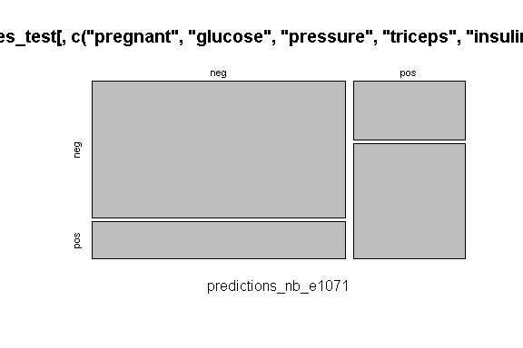

Business Intelligence Project
================
<Specify your name here>
<Specify the date when you submitted the lab>

- [Student Details](#student-details)
- [Setup Chunk](#setup-chunk)
- [Dataset loader](#dataset-loader)
- [Split the dataset](#split-the-dataset)
  - [Train a Naive Bayes classifier using the training
    dataset](#train-a-naive-bayes-classifier-using-the-training-dataset)
    - [naiveBayes() function in the e1071
      package](#naivebayes-function-in-the-e1071-package)
    - [naiveBayes() function in the caret
      package](#naivebayes-function-in-the-caret-package)
  - [Test the trained model using the testing
    dataset](#test-the-trained-model-using-the-testing-dataset)
    - [Test the trained e1071 Naive Bayes model using the testing
      dataset](#test-the-trained-e1071-naive-bayes-model-using-the-testing-dataset)
    - [Test the trained caret Naive Bayes model using the testing
      dataset](#test-the-trained-caret-naive-bayes-model-using-the-testing-dataset)
  - [View the Results](#view-the-results)
    - [e1071 Naive Bayes model and test results using a confusion
      matrix](#e1071-naive-bayes-model-and-test-results-using-a-confusion-matrix)

# Student Details

|                                              |     |
|----------------------------------------------|-----|
| **Student ID Number**                        | …   |
| **Student Name**                             | …   |
| **BBIT 4.2 Group**                           | …   |
| **BI Project Group Name/ID (if applicable)** | …   |

# Setup Chunk

**Note:** the following KnitR options have been set as the global
defaults: <BR>
`knitr::opts_chunk$set(echo = TRUE, warning = FALSE, eval = TRUE, collapse = FALSE, tidy = TRUE)`.

More KnitR options are documented here
<https://bookdown.org/yihui/rmarkdown-cookbook/chunk-options.html> and
here <https://yihui.org/knitr/options/>.

# Dataset loader

``` r
if (require("mlbench")) {
  require("mlbench")
} else {
  install.packages("mlbench", dependencies = TRUE,
                   repos = "https://cloud.r-project.org")
}
```

    ## Loading required package: mlbench

``` r
data(PimaIndiansDiabetes)
```

# Split the dataset

``` r
str(PimaIndiansDiabetes)
```

    ## 'data.frame':    768 obs. of  9 variables:
    ##  $ pregnant: num  6 1 8 1 0 5 3 10 2 8 ...
    ##  $ glucose : num  148 85 183 89 137 116 78 115 197 125 ...
    ##  $ pressure: num  72 66 64 66 40 74 50 0 70 96 ...
    ##  $ triceps : num  35 29 0 23 35 0 32 0 45 0 ...
    ##  $ insulin : num  0 0 0 94 168 0 88 0 543 0 ...
    ##  $ mass    : num  33.6 26.6 23.3 28.1 43.1 25.6 31 35.3 30.5 0 ...
    ##  $ pedigree: num  0.627 0.351 0.672 0.167 2.288 ...
    ##  $ age     : num  50 31 32 21 33 30 26 29 53 54 ...
    ##  $ diabetes: Factor w/ 2 levels "neg","pos": 2 1 2 1 2 1 2 1 2 2 ...

**Description:** 40% of the original data will be used to train the
model and 60% of the original data will be used to test the model.

``` r
library(caret)
```

    ## Loading required package: ggplot2

    ## Loading required package: lattice

``` r
train_index <- createDataPartition(PimaIndiansDiabetes$diabetes,
                                   p = 0.40,
                                   list = FALSE)
PimaIndiansDiabetes_train <- PimaIndiansDiabetes[train_index, ]
PimaIndiansDiabetes_test <- PimaIndiansDiabetes[-train_index, ]
```

## Train a Naive Bayes classifier using the training dataset

### naiveBayes() function in the e1071 package

``` r
PimaIndiansDiabetes_model_nb_e1071 <-
  e1071::naiveBayes(diabetes ~ .,
                    data = PimaIndiansDiabetes_train)
```

### naiveBayes() function in the caret package

``` r
PimaIndiansDiabetes_model_nb_caret <- # nolint
  caret::train(diabetes ~ ., data =
               PimaIndiansDiabetes_train[, c("pregnant", "glucose", "pressure",
                    "triceps", "insulin","mass", "pedigree","age","diabetes")],
               method = "naive_bayes")
```

## Test the trained model using the testing dataset

### Test the trained e1071 Naive Bayes model using the testing dataset

``` r
predictions_nb_e1071 <-
  predict(PimaIndiansDiabetes_model_nb_e1071,
          PimaIndiansDiabetes_test[, c("pregnant", "glucose", "pressure",
                        "triceps", "insulin","mass","pedigree","age","diabetes")])
```

### Test the trained caret Naive Bayes model using the testing dataset

``` r
predictions_nb_caret <-
  predict(PimaIndiansDiabetes_model_nb_caret,
          PimaIndiansDiabetes_test[, c("pregnant", "glucose", "pressure",
                        "triceps", "insulin","mass","pedigree","age","diabetes")])
```

## View the Results

### e1071 Naive Bayes model and test results using a confusion matrix

``` r
print(predictions_nb_e1071)
```

    ##   [1] pos pos neg pos neg neg neg neg neg pos pos neg neg neg pos pos pos pos
    ##  [19] neg neg pos neg pos pos neg pos pos neg pos neg neg pos neg pos pos neg
    ##  [37] neg neg neg neg neg neg neg pos neg neg neg neg neg neg neg neg neg pos
    ##  [55] neg pos neg neg pos neg pos neg neg neg neg neg neg neg neg neg neg neg
    ##  [73] neg neg pos pos pos neg neg neg neg neg pos neg neg pos neg pos neg neg
    ##  [91] neg pos neg neg neg neg neg neg pos pos pos neg neg neg neg neg pos neg
    ## [109] pos pos pos neg pos neg neg neg neg neg pos neg pos pos neg neg pos pos
    ## [127] neg pos neg neg neg pos neg neg pos pos pos pos neg neg neg neg pos pos
    ## [145] pos neg neg pos neg pos neg neg neg neg pos neg neg neg neg neg neg neg
    ## [163] pos neg neg neg neg neg neg neg neg neg neg neg neg neg neg neg neg pos
    ## [181] neg pos neg neg neg neg pos neg neg pos pos neg neg neg neg neg neg neg
    ## [199] neg neg pos pos pos pos neg pos pos neg neg neg neg pos neg neg neg neg
    ## [217] pos neg pos neg neg neg neg neg neg pos pos neg pos pos neg neg pos neg
    ## [235] neg neg neg neg neg pos neg pos pos neg pos neg neg neg neg pos pos pos
    ## [253] neg neg neg neg neg neg pos neg neg neg neg neg pos neg neg neg neg neg
    ## [271] neg neg neg neg pos pos neg neg neg neg neg pos neg neg neg neg neg neg
    ## [289] pos neg neg pos pos pos neg neg neg pos neg neg pos neg pos pos neg neg
    ## [307] neg neg pos pos pos pos neg neg neg neg neg neg neg neg pos pos pos neg
    ## [325] neg pos neg neg neg neg neg pos neg neg neg neg neg neg neg neg neg pos
    ## [343] neg neg pos neg pos neg pos neg pos neg pos pos neg neg pos pos neg pos
    ## [361] neg pos neg pos neg neg neg neg pos neg neg neg neg neg neg neg neg neg
    ## [379] neg neg pos neg neg neg neg neg pos pos neg neg neg pos pos pos pos neg
    ## [397] neg neg pos pos pos pos pos neg neg neg neg neg neg neg neg pos neg pos
    ## [415] neg pos pos neg neg neg neg neg neg neg pos neg neg pos neg pos neg neg
    ## [433] neg neg neg neg neg neg neg neg neg neg neg neg neg pos pos pos neg neg
    ## [451] pos pos pos neg neg pos neg pos pos neg
    ## Levels: neg pos

``` r
caret::confusionMatrix(predictions_nb_e1071,
                       PimaIndiansDiabetes_test[, c("pregnant", "glucose",                               "pressure","triceps", "insulin","mass","pedigree","age",
                                                    "diabetes")]$diabetes)
```

    ## Confusion Matrix and Statistics
    ## 
    ##           Reference
    ## Prediction neg pos
    ##        neg 247  68
    ##        pos  53  92
    ##                                           
    ##                Accuracy : 0.737           
    ##                  95% CI : (0.6942, 0.7766)
    ##     No Information Rate : 0.6522          
    ##     P-Value [Acc > NIR] : 5.947e-05       
    ##                                           
    ##                   Kappa : 0.4072          
    ##                                           
    ##  Mcnemar's Test P-Value : 0.2031          
    ##                                           
    ##             Sensitivity : 0.8233          
    ##             Specificity : 0.5750          
    ##          Pos Pred Value : 0.7841          
    ##          Neg Pred Value : 0.6345          
    ##              Prevalence : 0.6522          
    ##          Detection Rate : 0.5370          
    ##    Detection Prevalence : 0.6848          
    ##       Balanced Accuracy : 0.6992          
    ##                                           
    ##        'Positive' Class : neg             
    ## 

``` r
plot(table(predictions_nb_e1071,
           PimaIndiansDiabetes_test[, c("pregnant", "glucose", "pressure",
           "triceps", "insulin","mass","pedigree","age","diabetes")]$diabetes))
```

<!-- -->
